# Integration and API Test Report

Date: 24/05/2022

Version: 1.0

# Contents

- [Dependency graph](#dependency graph)

- [Integration approach](#integration)

- [Tests](#tests)

- [Scenarios](#scenarios)

- [Coverage of scenarios and FR](#scenario-coverage)
- [Coverage of non-functional requirements](#nfr-coverage)

# Dependency graph 

```plantuml
@startuml
digraph dependencyGraph {
     SKUService -> SKUDataLayer;
     SKUService -> PositionDataLayer;
     SKUDataLayer -> SKUDTO;
     PositionDataLayer -> PositionDTO;

     SkuItemService -> SkuItemDataLayer;
     SkuItemService -> SKUDataLayer;
     SkuItemDataLayer -> SkuItemDTO;
     SKUDataLayer -> SKUDTO;

     PositionService -> PositionDataLayer;
     PositionDataLayer -> PositionDTO;

     UserService -> UserDataLayer;
     UserDataLayer -> UserDTO;

     TestResultService -> TestResultDataLayer;
     TestResultDataLayer -> TestResultDTO;
     TestResultService -> TestDescriptorDataLayer;
     TestResultService -> SkuItemDataLayer;
     TestDescriptorDataLayer -> TestDescriptorDTO;
     SkuItemDataLayer -> SkuItemDTO;

     TestDescriptorService -> TestDescriptorDataLayer;
     TestDescriptorDataLayer -> TestDescriptorDTO;
     TestDescriptorService -> SKUDataLayer;
     SKUDataLayer -> SKUDTO;

     ItemService -> ItemDataLayer;
     ItemDataLayer -> ItemDTO;
     ItemService -> SKUDataLayer;
     SKUDataLayer -> SKUDTO;

     RestockOrderService -> RestockOrderDataLayer;
     RestockOrderDataLayer -> RestockOrderDTO;
     RestockOrderService -> TestResultDataLayer;
     TestResultDataLayer -> TestResultDTO;

     ReturnOrderService -> ReturnOrderDataLayer;
     ReturnOrderDataLayer -> ReturnOrderDTO;
     ReturnOrderService -> RestockOrderDataLayer;
     RestockOrderDataLayer -> RestockOrderDTO;

     InternalOrderService -> InternalOrderDataLayer;
     InternalOrderDataLayer -> InternalOrderDTO;
}
@enduml
```

     
# Integration approach
    
We used a bottom up approach, starting from data layers to APIs, through services, controllers.

| Step number  |Involved modules |
|--|--|
|1|DBManager and data layers (unit testing)|
|2|Previous step's modules + services (integration testing)|
|3|Previous step's modules + controllers (API testing)|

#  Integration Tests

We didn't use any mock-ups because we used a bottom-up approach, so the modules of the previous steps are considered already correct (validated by the previous tests). We also set up a test database to avoid modifying the production one.

## Step 1
Step 1 is equal to unit testing, as described in UnitTestReport.md

## Step 2
| Classes  |Jest test suite |
|--|--|
|InternalOrderService|Internal Order Service Integration Tests|
|ItemService|Item Service Integration Tests|
|PositionService|Position Service Integration Tests|
|RestockOrderService|Restock Order Service Integration Tests|
|ReturnOrderService|Return Order Service Integration Tests |
|SkuService|Sku Service Integration Tests|
|SkuItemService|Sku Item Service Integration Tests|
|TestDescriptorService|Test Descriptor Service Integration Tests|
|TestResultService|Test Result Service Integration Tests|
|UserService|User Service Integration Tests|

## Step 3 

   
| Classes |Jest test suite |
|--|--|
|InternalOrderController|Test Internal Order APIs|
|ItemController|Test Item APIs|
|PositionController|Test Position APIs|
|RestockOrderController|Test Restock Order APIs|
|ReturnOrderController|Test Return Order APIs |
|SkuController|Test Sku APIs|
|SkuItemController|Test Sku Item APIs|
|TestDescriptorController|Test Test Descriptor APIs|
|TestResultController|Test Test Result APIs|
|UserController|Test User APIs|

# API testing - Scenarios

# Coverage of Scenarios and FR

| Scenario ID | Functional Requirements covered | Mocha  Test(s) | 
| ----------- | ------------------------------- | ----------- | 
|  1-1        | FR2.1                            |  testSkuAPIs.newSku |             
|  1-2        | FR2.1                             | testSkuAPIs.updateSkuPosition  |             
| 1-3         | FR2.1                            |   testSkuAPIs.updateSku          |             
| 2-1         |  FR3.1.1                               |   testPositionAPIs.newPosition          |             
| 2-2         |   FR3.1.1, FR3.1.4                              |  testPositionAPIs.updatePositionID           |             
| 2-3         |    FR3.1.1, FR3.1.4                             |   testPositionAPIs.updatePosition          |             
| 2-4         |    FR3.1.1, FR3.1.4                             |   testPositionAPIs.updatePositionID          |     
| 2-5         |    FR3.1.2                            |    testPositionAPIs.deletePosition         |   
| 3-1         |    FR5.6                           |   testRestockOrderAPIs.newRestockOrder          |   
| 3-2         |    FR5.6                              |   testRestockOrderAPIs.newRestockOrder          |   
| 4-1         |    FR1.1, FR1.5                            |  testUserAPIs.newUser           |   
| 4-2         |    FR1.5                            |    testUserAPIs.updateUser         | 
| 4-3         |    FR1.2                            |    testUserAPIs.deleteUser         | 
| 5-1-1       |    FR5.8.1, FR5.7     |   testRestockOrderAPIs.modifyState, testSkuItemAPIs.newSkuItem        | 
| 5-2-1       |    FR5.8.2                           | testTestResultAPIs.newTestResult            |
| 5-2-2       |    FR5.8.2                           |    testTestResultAPIs.newTestResult         |
| 5-2-3       |    FR5.8.2                                   |    testTestResultAPIs.newTestResult         |
| 5-3-1       |    FR5.8.3                                   |   testRestockOrderAPIs.addItemsToRestockOrder, testRestockOrderAPIs.modifyState |
| 5-3-2       |    FR5.8.3                                     |  testRestockOrderAPIs.addItemsToRestockOrder, testRestockOrderAPIs.modifyState           |
| 5-3-3       |    FR5.8.3                                     |  testRestockOrderAPIs.addItemsToRestockOrder, testRestockOrderAPIs.modifyState           |
| 6-1         |    FR5.9, FR5.10, FR5.11                       |   testReturnOrderAPIs.newReturnOrder          |
| 6-2         |    FR5.9, FR5.10, FR5.11                       |   testReturnOrderAPIs.newReturnOrder          |
| 7-1         |    FR1.5                                       |   testUserAPIs.login          |
| 7-2         |   FR1.5                                        |    testUserAPIs.logout         |
| 9-1         |    FR6.1, FR6.2, FR6.3, FR6.5, FR6.6, FR6.7    |   testInternalOrderAPIs.newInternalOrder, testInternalOrderAPIs.modifyInternalOrder          |
| 9-2         |    FR6.1, FR6.2, FR6.3, FR6.5, FR6.6, FR6.7    |   testInternalOrderAPIs.newInternalOrder, testInternalOrderAPIs.modifyInternalOrder          |
| 9-3         |  FR6.1, FR6.2, FR6.3, FR6.5, FR6.6, FR6.7      |   testInternalOrderAPIs.newInternalOrder, testInternalOrderAPIs.modifyInternalOrder          |
| 10-1        |  FR6.7, FR6.8, FR6.9                           |    testInternalOrderAPIs.modifyInternalOrder         |
| 11-1        |  FR7                                           |    testItemAPIs.newItem         |
| 11-2        |  FR7                                           |     testItemAPIs.modifyItem        |
| 12-1        |  FR3.2                                         |      testTestDescriptorAPIs.newTestDescriptor       |
| 12-2        |  FR3.2                                         |     testTestDescriptorAPIs.updateTestDescriptor        |
| 12-3        |  FR3.2                                         |     testTestDescriptorAPIs.deleteTestDescriptor       |

# Coverage of Non Functional Requirements

### 

| Non Functional Requirement | Test suite |
| -------------------------- | --------- |
|    NFR4    |   Test Position APIs, Test Sku APIs |
|    NFR6     | Test Internal Order APIs, Test Restock Order APIs, Test Return Order APIs, Test Sku Item APIs, Test Test Result APIs        |
|    NFR9      |Test Internal Order APIs, Test Restock Order APIs, Test Return Order APIs, Test Sku Item APIs, Test Test Result APIs         |

