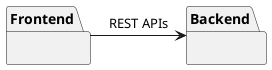
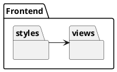
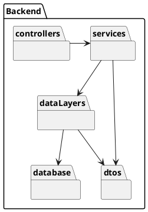
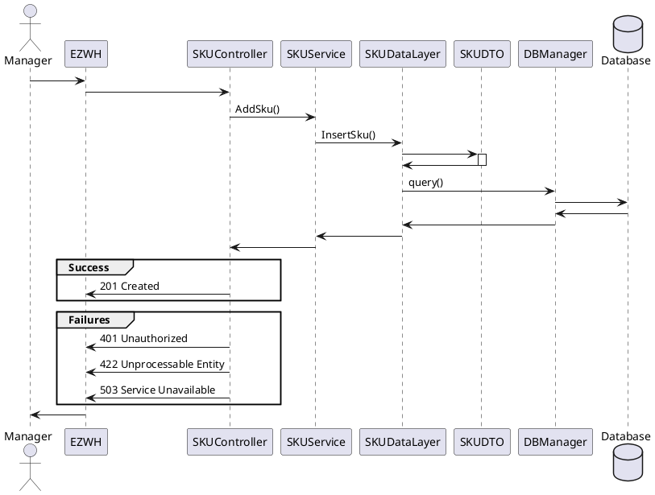
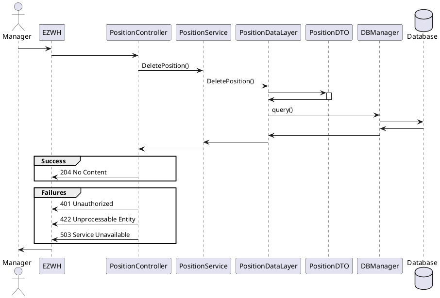
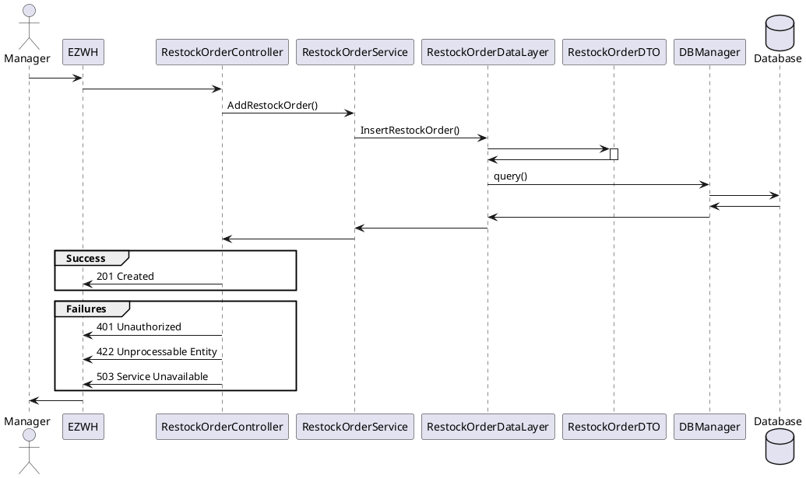
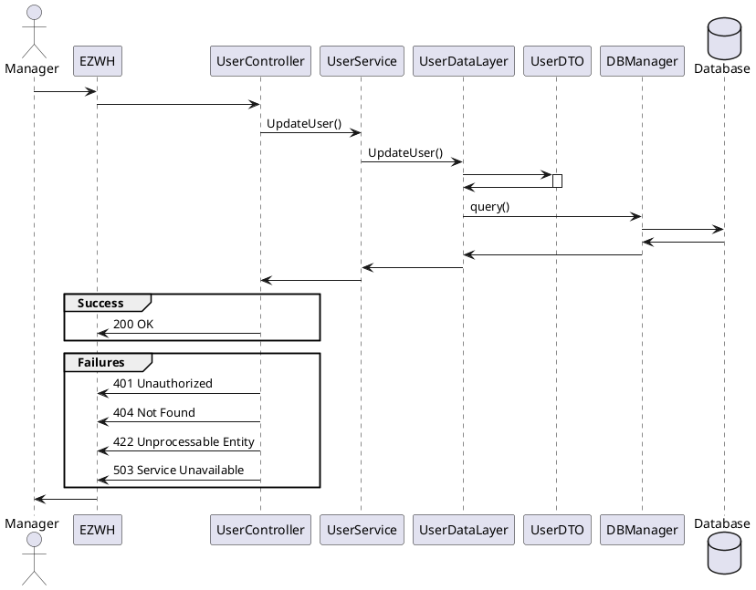

# Design Document 

Authors: Group 28

Date: 27/04/2022

Version: 1.6

# Contents

- [High level design](#package-diagram)
- [Low level design](#class-diagram)
- [Verification traceability matrix](#verification-traceability-matrix)
- [Verification sequence diagrams](#verification-sequence-diagrams)

# Instructions

The design must satisfy the Official Requirements document 

# High level design 

The chosen architectural patterns are: 
-   client-server model
-   layered style (3-tier architecture) 
-   MVC

The clients will be the PCs of the users interacting with EZWH and they will not contain any logic.
The server will be made of two parts, the frontend and the backend.
The frontend will be the part collecting and visualizing data, which will be sent to the backend, where the logic resides.

The 3 layers are: 
-   Presentation (frontend), which is the GUI
-   Application Logic (which is part of the backend)
-   Data Layer (which is part of the backend)

The MVC pattern will be implemented as follows:
-   View: this will be the frontend
-   Model: this will be inside the backend
-   Controller: this will be inside the backend

We assume that data are stored inside a database and controllers fetch or modify them, if needed.

## Front End

The Frontend component consists of: 
- Views: the package contains .html and .js files which compose the user's GUI. The views are rendered according to the layout defined in .html files and the data are retrieved from the backend through the REST APIs accessed by the .js files (all the logic about the data is managed in the backend, the frontend only collects data, performs the calls and displays the results)
- Styles: it contains .css styles used to manage GUI appearance and layout

## Back End

The Backend component consists of: 
- Controllers: they contain the methods which map 1:1 the API exposed through routes. They invoke the services which apply the logics. 
- Services: they gets the data as dtos from the DB through the data layers and manipulates them applying the logic.
- DTOs: they are the structure of our data, which are manipulated by the services and the data layers and returned following an API call.
- Data layers: they are responsible to build the queries for the corresponding services and sending them to the DBManager.
- Database: it is composed of the database and of a DBManager which is responsible to manage the DB connection and the operations on the DB itself.  

Following MVC pattern, the C part is implemented by Controllers + Services, while the M part is implemented by DTOs + Data Layers.
This design follows Spring MVC guidelines regarding the division of C part (controllers + services).

# Low level design
The EZWH class is our facade, which uses routes to expose APIs and link them to methods inside controllers.
Each controller calls its service, which stores all the logic and manipulates the data contacting needed data layers.
Data are managed through data layers (which, through DBManager, communicates with the database) and DTOs, classes that maps 1:1 tables of the database.

```plantuml
@startuml
top to bottom direction

class EZWH {
  skuController : Object
  skuItemController : Object
  positionController : Object
  testDescriptorController : Object
  testResultController : Object
  userController : Object
  restockOrderController : Object
  returnOrderController : Object
  internalOrderController : Object
  itemController : Object
}



package "controllers" {
  class SKUController {
    SKUService ss
    +GetAllSkus(): List
    +GetSku(): SKU
    +AddSku(): Integer
    +UpdateSku(): Integer
    +UpdateSkuPosition(): Integer
    +DeleteSku(): Integer
  }

  class SKUItemController {
    SKUItemService sis
    +GetAllSkuItems(): List
    +GetAvailableSkuItems(): List
    +GetSkuItem(): SKUItem
    +AddSkuItem(): Integer
    +UpdateSkuItem(): Integer
    +DeleteSkuItem(): Integer
  }

  class PositionController {
    PositionService ps
    +GetAllPositions(): List
    +AddPosition(): Integer
    +UpdatePosition(): Integer
    +UpdatePositionID(): Integer
    +DeletePosition(): Integer
  }

  class TestDescriptorController {
    TestDescriptorService tds
    +GetAllTestDescriptors(): List
    +GetTestDescriptor(): TestDescriptor
    +AddTestDescriptor(): Integer
    +UpdateTestDescriptor(): Integer
    +DeleteTestDescriptor(): Integer
  }

  class TestResultController {
    TestResultService trs
    +GetAllTestResults(): List
    +GetTestResult(): TestResult
    +AddTestResult(): Integer
    +UpdateTestResult(): Integer
    +DeleteTestResult(): Integer
  }

  class UserController {
    UserService us
    +GetAllUsersExceptManagers(): List
    +GetAllUsersByType(): List
    +GetUser(): User
    +AddUser(): Integer
    +LogInUser(): User
    +LogOutUser(): Integer
    +UpdateUser(): Integer
    +DeleteUser(): Integer
  }

  class RestockOrderController {
    RestockOrderService ros
    +GetAllRestockOrders(): List
    +GetAllRestockOrdersByState(): List
    +GetRestockOrder(): RestockOrder
    +GetRestockOrderSKUItemsToReturn(): List
    +AddRestockOrder(): Integer
    +UpdateRestockOrder(): Integer
    +UpdateRestockOrderSkuItems(): Integer
    +UpdateRestockOrderTransportNote(): Integer
    +DeleteRestockOrder(): Integer
  }

  class ReturnOrderController {
    ReturnOrderService ros
    +GetAllReturnOrders(): List
    +GetReturnOrder(): ReturnOrder
    +AddReturnOrder(): Integer
    +DeleteReturnOrder(): Integer
  }

  class InternalOrderController {
    InternalOrderService ios
    +GetAllInternalOrders(): List
    +GetAllInternalOrdersByState(): List
    +GetInternalOrder(): InternalOrder
    +AddInternalOrder(): Integer
    +UpdateInternalOrder(): Integer
    +DeleteInternalOrder(): Integer
  }

  class ItemController {
    ItemService is
    +GetAllItems(): List
    +GetItem(): Item
    +AddItem(): Integer
    +UpdateItem(): Integer
    +DeleteItem(): Integer
  }
}

package "services" {
  class SKUService {
    SKUDataLayer skuDL
    PositionDataLayer positionDL
    +GetAllSkus(): List
    +GetSku(): SKU
    +AddSku(): Integer
    +UpdateSku(): Integer
    +UpdateSkuPosition(): Integer
    +DeleteSku(): Integer
  }

  class SKUItemService {
    SKUDataLayer skuDL
    SKUItemDataLayer skuItemDL
    +GetAllSkuItems(): List
    +GetAvailableSkuItems(): List
    +GetSkuItem(): SKUItem
    +AddSkuItem(): Integer
    +UpdateSkuItem(): Integer
    +DeleteSkuItem(): Integer
  }

  class PositionService {
    PositionDataLayer positionDL
    +GetAllPositions(): List
    +AddPosition(): Integer
    +UpdatePosition(): Integer
    +UpdatePositionID(): Integer
    +DeletePosition(): Integer
  }

  class TestDescriptorService {
    TestDescriptorDataLayer testDescDL
    SKUDataLayer skuDL
    +GetAllTestDescriptors(): List
    +GetTestDescriptor(): TestDescriptor
    +AddTestDescriptor(): Integer
    +UpdateTestDescriptor(): Integer
    +DeleteTestDescriptor(): Integer
  }

  class TestResultService {
    TestResultDataLayer testResDL
    TestDescriptorDataLayer testDescDL
    SKUItemDataLayer skuItemDL
    +GetAllTestResults(): List
    +GetTestResult(): TestResult
    +AddTestResult(): Integer
    +UpdateTestResult(): Integer
    +DeleteTestResult(): Integer
  }

  class UserService {
    UserDataLayer userDL
    List types (possible values: \n['customer', 'qualityEmployee', 'clerk', \n'deliveryEmployee', 'supplier', 'manager', 'admin'])
    +GetAllUsersExceptManagers(): List
    +GetAllUsersByType(): List
    +GetUser(): User
    +AddUser(): Integer
    +LogInUser(): User
    +LogOutUser(): Integer
    +UpdateUser(): Integer
    +DeleteUser(): Integer
  }

  class RestockOrderService {
    restockOrderDataLayer restockOrderDL
    testResultDataLayer testResultDL
    +GetAllRestockOrders(): List
    +GetAllRestockOrdersByState(): List
    +GetRestockOrder(): RestockOrder
    +GetRestockOrderSKUItemsToReturn(): List
    +AddRestockOrder(): Integer
    +UpdateRestockOrder(): Integer
    +UpdateRestockOrderSkuItems(): Integer
    +UpdateRestockOrderTransportNote():  Integer
    +DeleteRestockOrder(): Integer
  }


  class InternalOrderService {
    internalOrderDataLayer internalOrderDL
    +GetAllInternalOrders(): List
    +GetAllIssuedInternalOrdersByState(): List
    +GetInternalOrder(): InternalOrder
    +AddInternalOrder(): Integer
    +UpdateInternalOrder(): Integer
    +DeleteInternalOrder(): Integer
  }

  class ItemService {
    itemDataLayer itemDL
    SKUDataLayer SKUDL
    +GetAllItems(): List
    +GetItem(): Item
    +AddItem(): Integer
    +UpdateItem(): Integer
    +DeleteItem(): Integer
  }

  class ReturnOrderService {
    returnOrderDataLayer returnOrderDL
    restockOrderDataLayer restockOrderDL
    +GetAllReturnOrders(): List
    +GetReturnOrder(): ReturnOrder
    +AddReturnOrder(): Integer
    +DeleteReturnOrder(): Integer
  }

  left to right direction
  ReturnOrderService -[hidden]> InternalOrderService
  RestockOrderService -[hidden]> InternalOrderService

}

package "database" {
  class DBManager{
  dbAddress : String
  db: sqlite3.Database
  +openConnection() : Connection
  +closeConnection()  : void
  +get() : List
  +query() : Integer
  }
}

package "dataLayers" {
  class SKUDataLayer{
    DBManager dbManager
    +getAllSkus(): List
    +getSku(): SKU
    +insertSku(): Integer
    +updateSku(): Integer
    +updatePosition(): Integer
    +deleteSku(): Integer
  }

  class SKUItemDataLayer{
    DBManager dbManager
    +GetAllSkuItems(): List
    +GetAvailableSkuItems(): List
    +GetSkuItem(): SKUItem
    +InsertSkuItem(): Integer
    +UpdateSkuItem(): Integer
    +DeleteSkuItem(): Integer
  }

  class PositionDataLayer{
    DBManager dbManager
    +GetAllPositions(): List
    +GetPosition(): Position
    +InsertPosition(): Integer
    +UpdatePosition(): Integer
    +UpdatePositionID(): Integer
    +DeletePosition(): Integer
  }

  class TestDescriptorDataLayer{
    DBManager dbManager
    +GetAllTestDescriptors(): List
    +GetTestDescriptor(): TestDescriptor
    +InsertTestDescriptor(): Integer
    +UpdateTestDescriptor(): Integer
    +DeleteTestDescriptor(): Integer
  }

  class TestResultDataLayer{
    DBManager dbManager
    +GetAllTestResults(): List
    +GetTestResult(): TestResult
    +InsertTestResult(): Integer
    +UpdateTestResult(): Integer
    +DeleteTestResult(): Integer
  }

  class UserDataLayer{
    DBManager dbManager
    +GetAllUsersExceptManagers(): List
    +GetAllUsersByType(): List
    +GetUser(): User
    +InsertUser(): Integer
    +UpdateUser(): Integer
    +DeleteUser():Integer
  }

  class RestockOrderDataLayer{
    DBManager dbManager
    +GetAllRestockOrders(): List
    +GetProductsByRestockOrder(): List
    +GetSKUItemsByRestockOrder(): List
    +GetAllRestockOrdersByState(): List 
    +GetRestockOrder(): RestockOrder
    +GetRestockOrderSKUItemsToReturn(): List
    +AddRestockOrder(): Integer
    +AddProducts(): Integer
    +UpdateRestockOrder(): Integer
    +UpdateRestockOrderSkuItems(): Integer
    +UpdateRestockOrderTransportNote(): Integer
    +DeleteRestockOrder(): Integer
  }

  class ReturnOrderDataLayer{
    DBManager dbManager
    +GetAllReturnOrders(): List
    +GetReturnOrderProducts(): List
    +GetReturnOrder(): ReturnOrder 
    +InsertReturnOrder(): Integer
    +AddReturnOrderProduct(): Integer
    +DeleteReturnOrder(): Integer
  }

  class InternalOrderDataLayer{
    DBManager dbManager
    +GetAllInternalOrders(): List
    +GetAllInternalOrdersByState(): List
    +GetInternalOrder(): InternalOrder
    +InsertInternalOrder(): Integer
    +UpdateInternalOrder(): Integer
    +DeleteInternalOrder(): Integer
    +AddProduct(): Integer
    +UpdateProduct(): Integer
    +getProductsByInternalOrder(): List
    +getProductsByCompletedInternalOrder(): List
  }

  class ItemDataLayer{
    DBManager dbManager
    +GetAllItems(): List
    +GetItem(): Item
    +InsertItem(): Integer
    +UpdateItem(): Integer
    +DeleteItem(): Integer
    +SearchItem(): Item
  }
}



package "dtos" {
  class UserDTO {
    id: Integer
    name: String
    surname: String
    email: String
    type: String
  }

  class RestockOrderDTO {
    id: Integer
    issueDate: Date
    state: String 
    products: List
    supplierId: Integer
    transportNote: Date
    skuItems: List 
  }

  class InternalOrderDTO {
    id: Integer
    issueDate: Date
    state: String
    products: List
    customerId: Integer
  }

  class ItemDTO {
    id: Integer
    description: String
    price: Float
    SKUId: String
    supplierId: Integer  
  }

  class ReturnOrderDTO {
    id: Integer
    returnDate: Date
    products: List
    restockOrderId: Integer 
  }

  class SKUDTO {
    id: String
    description: String
    weight: Integer
    volume: Integer
    notes: String
    position: String
    availableQuantity: Integer
    price: Float
    testDescriptors: List
  }

  class SKUItemDTO {
    RFID: String
    SKUId: String
    Available: Boolean
    DateOfStock: Date
  }

  class TestDescriptorDTO {
    id: Integer
    name: String
    procedureDescription: String
    idSKU: String
  }

  class TestResultDTO {
    id: Integer
    idTestDescriptor: Integer
    Date: Date
    Result: Boolean
  }

  class PositionDTO {
    positionID: String
    aisleID: Integer
    row: Integer
    col: Integer
    maxWeight: Integer
    maxVolume: Integer
    occupiedWeight: Integer
    occupiedVolume: Integer
  }
}

EZWH -down-> controllers
controllers -down-> services
services -down-> dataLayers
services -down-> dtos
dataLayers -down-> dtos
dataLayers -down-> database

@enduml
```

# Verification traceability matrix

\<for each functional requirement from the requirement document, list which classes concur to implement it>

| | SKUService| SKUItemService |  PositionService | TestDescriptorService|TestResultService|UserService|RestockOrderService|ReturnOrderService|InternalOrderService|ItemService|
|--|--|--|--|--|--|--|--|--|--|--|
|FR1||||||x|||||
|FR2|x||||||||||
|FR3|||x|x|||||||
|FR4||||||x|||||
|FR5||x|||x||x|x||x|
|FR6|||||||||x||
|FR7||||||||||x|

# Verification sequence diagrams 

## Scenario 1-1

## Scenario 2-5

## Scenario 3-1

## Scenario 4-2

