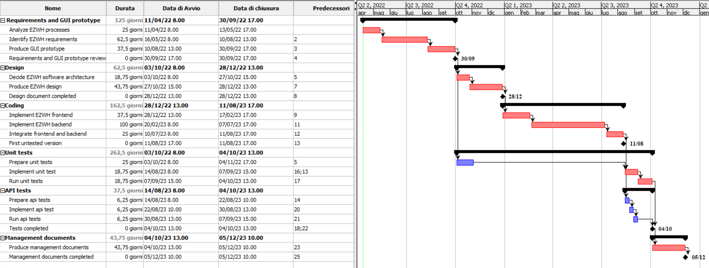

# Project Estimation  
Date: 11/04/2022
Version: 1.0 

# Estimation approach
Consider the EZWH  project as described in YOUR requirement document, assume that you are going to develop the project INDEPENDENT of the deadlines of the course
# Estimate by size
### 
|             | Estimate                        |             
| ----------- | ------------------------------- |  
| NC =  Estimated number of classes to be developed   |       50         |             
|  A = Estimated average size per class, in LOC       |       1000   LOC                  | 
| S = Estimated size of project, in LOC (= NC * A) | 50000 LOC |
| E = Estimated effort, in person hours (here use productivity 10 LOC per person hour)  |    5000 person hours  (for the whole project)    |   
| C = Estimated cost, in euro (here use 1 person hour cost = 30 euro) | 150 000 euro | 
| Estimated calendar time, in calendar weeks (Assume team of 4 people, 8 hours per day, 5 days per week ) | 5000/(4*(8*5)) = 31.25|               

# Estimate by product decomposition
### 
|         component name    | Estimated effort (person hours)   |             
| ----------- | ------------------------------- | 
|requirement document    |640|
| GUI prototype |320|
|design document | 480 |
|code |1280|
| unit tests |600|
| api tests |200|
| management documents  |350|

# Estimate by activity decomposition
### 
|         Activity name    | Estimated effort (person hours)   |             
| ----------- | ------------------------------- | 
| Analyze EZWH processes | 200 |
| Identify EZWH requirements | 500 |
| Produce GUI prototype | 300 |
| Decide EZWH software architecture | 150 |
| Produce EZWH design | 350 |
| Implement EZWH frontend  | 300 |
| Implement EZWH backend | 800 |
| Integrate frontend and backend | 200 |
| Prepare unit tests | 200 |
| Implement unit test | 150 |
| Run unit tests  | 150 |
| Prepare api tests | 50 |
| Implement api test | 50 |
| Run api tests  | 50 |
| Produce management documents |350|
###

###
|Milestones|
|----------|
|Requirements and GUI prototype reviewed|
|Design document completed|
|First untested version|
|Tests performed|
|Management documents completed|
###

###
|Deliverables|
|------------|
|Requirements Document|
|GUI Prototype|
|Design Document|
|Code|
|Unit tests|
|API tests|
|Management documents|
|Time Sheet|
###

# Summary

Report here the results of the three estimation approaches. The  estimates may differ. Discuss here the possible reasons for the difference

|             | Estimated effort                        |   Estimated duration |          
| ----------- | ------------------------------- | ---------------|
| estimate by size |5000 person hours|31.25 calendar weeks|
| estimate by product decomposition |3870 person hours|24.1875 calendar weeks|
| estimate by activity decomposition |5550 persom hours|34.6875 calendar weeks|

