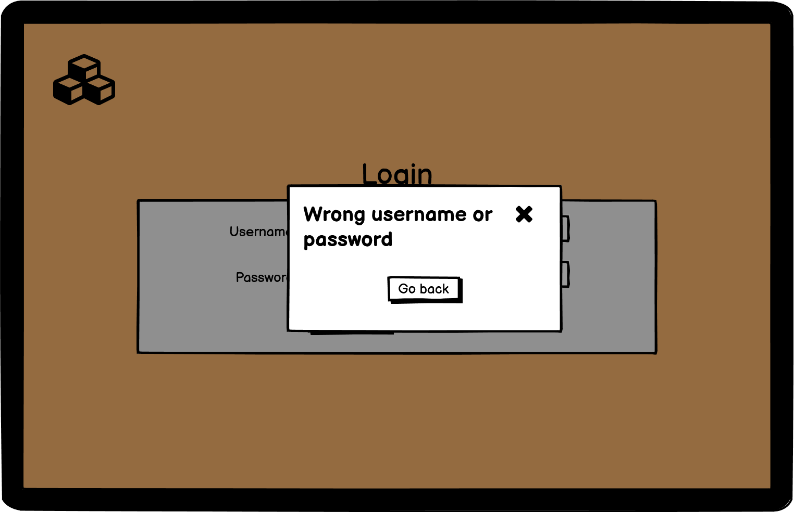
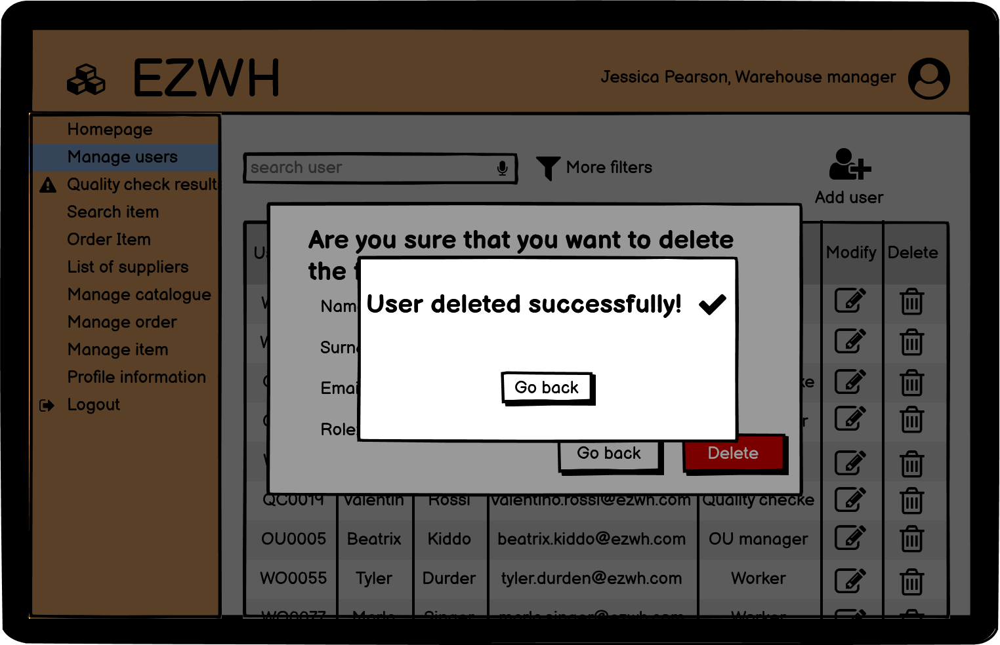
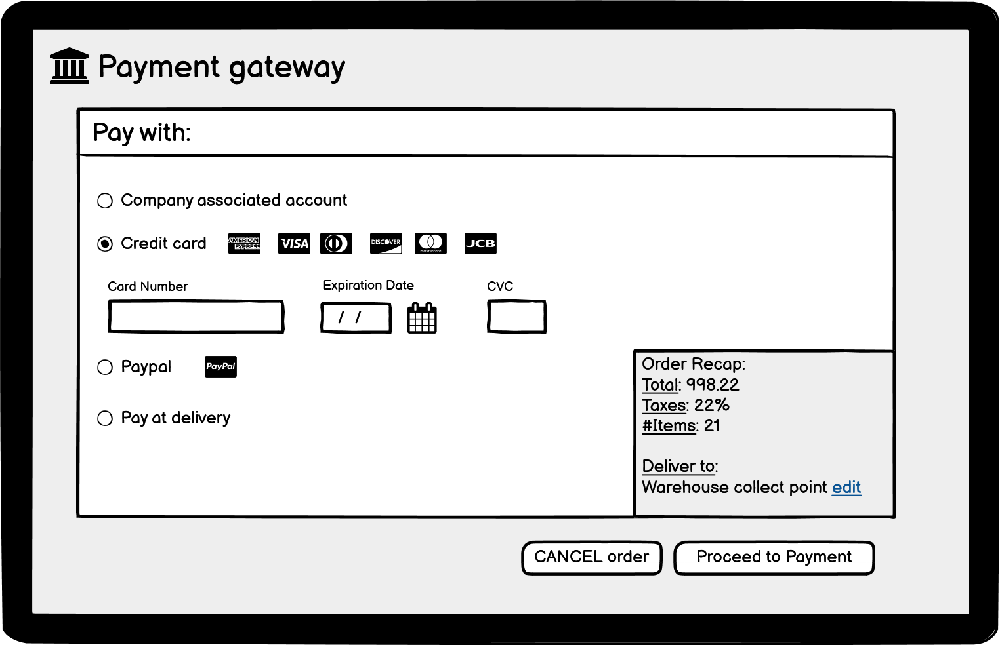
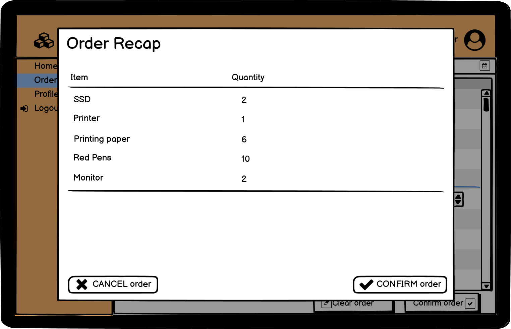
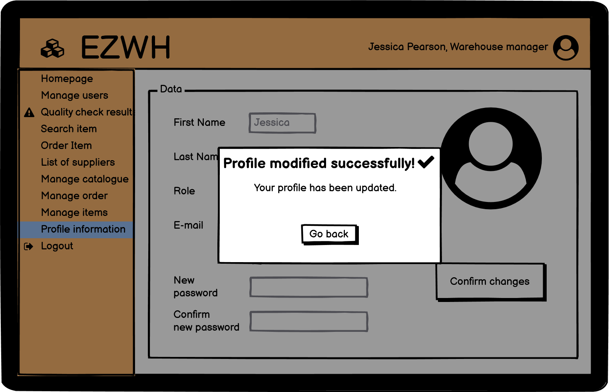

# Graphical User Interface Prototype  

Authors: Group 28

Date: 11/04/2022

Version: 1.2

# Contents

- [Login interface](#login-interface)
- [WM interface](#warehouse-manager-interface)
    + [Homepage](#home)
        + [Logout](#logout)
    + [Manage Users](#manage-user)
        + [Create users](#create-user)
        + [Modify users](#modify-user)
        + [Delete users](#delete-user)
    + [Quality check results](#quality-check-results)
        + [Return item](#return-item)
    + [List of suppliers](#list-of-suppliers)
        + [Add supplier](#add-supplier)
        + [Modify supplier](#modify-supplier)
        + [Delete supplier](#delete-supplier)
    + [Search item](#search-item)
    + [Order item](#order-item)
        + [Order recap](#order-recap)
            + [Order unsuccessful](#order-unsuccessful)
        + [Payment gateway](#payment-gateway)
        + [Order successful](#order-successful)
    + [Profile Information](#profile-information)
- [OUM interface](#ou-manager-interface)
    + [Homepage](#oum-home)
    + [Internal Order](#int-order)
- [QC interface](#qc-interface)
    + [Homepage](#qc-home)
    + [Quality Check](#quality-check)
- [Worker interface](#worker-interface)
    + [Homepage](#w-home)
    + [Manage Items](#manage-items)

# Login interface

# Warehouse manager interface

## Home

## Logout

## Manage user

### Create user

### Modify user

### Delete user

## Quality check results

### Return item

## Search item
Via the following interface the warehouse manager is able to search through the items available in the warehouse, by itemID or choosing more appropriate filters:

## Order item
By clicking on this section of the sidebar, the warehouse manager will be able to start a new external order: 

### Order recap
After a confirmation he/she will be redirected to an order recap page:

#### Order unsuccessful
At this step, if the requested item wouldn't fit in the available space in the warehouse, a message will appear before confirmation:

### Payment gateway
Afterwards he/she will be redirected to the payment gateway of the chosen payment service:

#### Order successful
If the payment is successful a confirmation message is displayed bu the application:
 

## List of suppliers

### Add supplier

### Modify supplier

### Delete supplier

## Manage catalogue

### Modify item

### Add item

### Delete item

## Manage orders
In this page are visible both external and internal orders:

# OUM interface
## OUM Home

## Int Order

# QC interface
## QC Home

## Quality Check

# W interface
## W Home

## Manage Items

# Profile information

